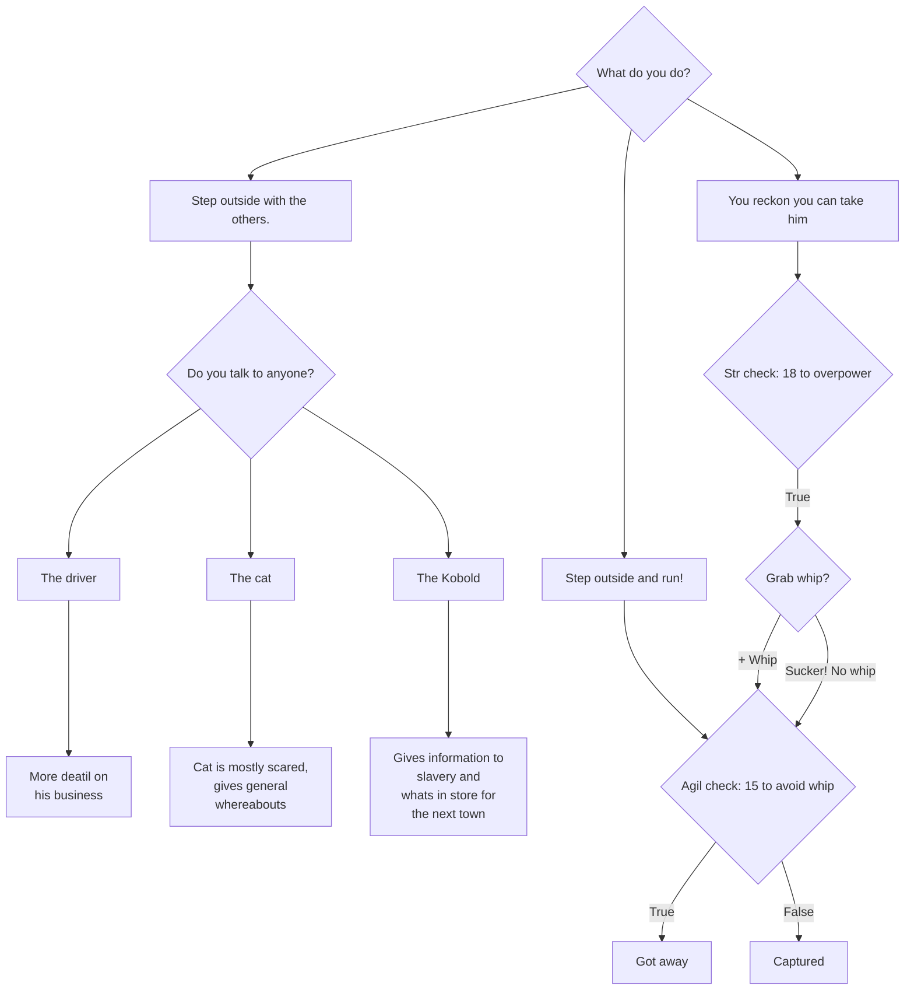

# Prologue

After our character creation we are immediately transported to a dark scene.
*fade to black*.

## Cart

### Int - Blindfolded

Our vision is mostly obscured through a blindfold, giving us only glimpses of what looks to be the inside of an old horse-cart.

We hear the sounds of squeeking cart wheels and the occasional snort of a strained horse...

The cart stops...

### Int - blindfold removed

Someone mounts the cart, removes our blindfold and annouces,

> __Driver:__ Right you lot, rest break!

The creature before us is a tough looking lizard wearing leather armour and a whip, he looks to us

*__Image: Driver Neutral__*
> __Driver:__ Oh you're awake now, good. I found's you on the side of the road passed out, must of been bandits or something as you looked in a sorry state an' nothin' on yer save for them clothes of yours.

*__Image: Driver Serious__*
> Anyway, you're mine now see, slavers rights and all that.... I'm taking you to Sabel, to be sold. I suppose you could try to run, of course I'd have to catch you and give you and good punishing. 

***

***
